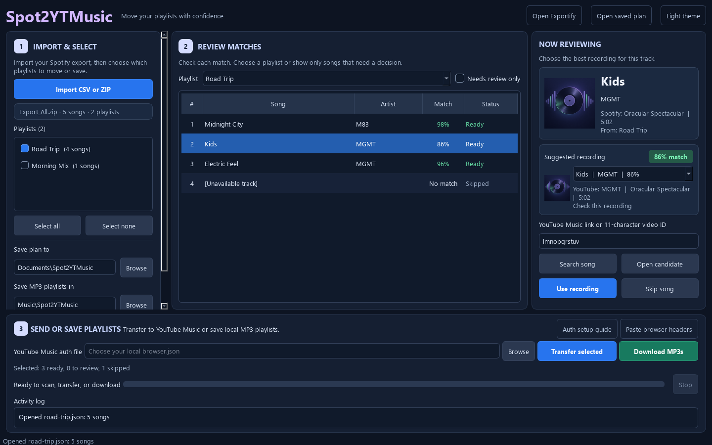

[](https://github.com/SysAdminDoc/Spot2YTMusic/releases/tag/v0.2.0) [](LICENSE) [](https://github.com/SysAdminDoc/Spot2YTMusic/releases/latest)

**Take your Spotify playlists to YouTube Music, or keep a local MP3 copy.** Spot2YTMusic opens your playlist exports, searches YouTube Music, and lets you check uncertain matches before anything is sent or saved. Choose either destination, or both. A stopped transfer or download can pick up where it left off.

[Download the Windows app](https://github.com/SysAdminDoc/Spot2YTMusic/releases/latest) or [install the Python tool](#run-from-source). The app runs locally. It needs no Spotify developer account.



Playlist choices sit on the left, match review stays in the middle, and recording details are on the right. Transfer and MP3 controls stay below the workspace. See a [song awaiting review](docs/screenshots/desktop.png) or the [light theme](docs/screenshots/desktop-light.png).

## Move or save your playlists

1. Open [Exportify](https://exportify.app/) from the app and sign in to Spotify. Download individual playlist CSVs or use **Export All** for a ZIP.
2. Import the files. You can choose several CSVs, a ZIP, or both. Check the playlists you want, pick where to save the plan, then click **Scan selected**. Searches already completed stay in the local cache if you stop and resume.
3. Check songs marked **Review**. Compare the Spotify album and duration with each suggested recording and its match notes. Listen or search YouTube Music yourself. Choose **Use recording** or **Skip song**. Each choice is saved as you make it.
4. To move them to your account, set up YouTube Music authentication in the app and click **Transfer selected**. To keep local files, choose an MP3 folder and click **Download MP3s**. You can use both buttons on the same reviewed plan. MP3 downloads don't need account authentication or a prior transfer.

Strong matches are selected for you. The app waits for your decision on uncertain songs in the playlists you've checked. Each scan saves its own plan, so you can scan another group later and reopen an earlier plan. Transfers create private playlists and verify the song order after every batch. Local downloads create a folder per playlist with numbered, tagged MP3s and a `playlist.m3u8` file. Repeated songs stay repeated. Completed MP3s and downloaded audio are reused on the next run.

### Download MP3s

The Windows app needs [yt-dlp](https://github.com/yt-dlp/yt-dlp/releases), [FFmpeg and ffprobe](https://ffmpeg.org/download.html), and [Deno](https://docs.deno.com/runtime/getting_started/installation/) or Node.js installed before you click **Download MP3s**. Put their executables on `PATH` or beside `Spot2YTMusic.exe`. The app checks for them and reports what's missing. The Windows release doesn't bundle these tools, so it stays a smaller download. [yt-dlp's audio conversion](https://github.com/yt-dlp/yt-dlp#post-processing-options) uses FFmpeg.

Choose the playlists you want, finish their review decisions, and pick **Save MP3 playlists in**. The app downloads only the chosen YouTube video IDs, tags files with the Spotify title, artist, album, and track number, and writes an M3U8 playlist in source order. If one video is unavailable, the other songs continue. The activity log shows the failed song, and another run retries it. **Stop** ends the current download and keeps completed files.

Use downloads only for recordings you're allowed to save. [YouTube's terms](https://www.youtube.com/t/terms) restrict downloading and automated access unless the service permits it or you have the required written permissions. [YouTube Premium offline downloads](https://support.google.com/youtube/answer/7381437?hl=en) aren't MP3 exports.

The [Exportify project](https://github.com/watsonbox/exportify) runs in your browser. Spotify's own [Download your data](https://support.spotify.com/us/article/understanding-your-data/) produces JSON, which Spot2YTMusic does not read yet.

## What stays on your computer

The imported files, match cache, plan, review sheet, transfer state, and downloaded MP3s stay local. Search queries containing song titles and artists go to YouTube Music. yt-dlp requests the reviewed YouTube recordings when you start a download. An auth file created in the app stays in your Windows profile. Don't share it or paste its contents into an issue.

Spot2YTMusic uses the unofficial [ytmusicapi](https://ytmusicapi.readthedocs.io/en/stable/) library for YouTube Music search and transfer. A site change can interrupt either step. Download availability also depends on yt-dlp and the selected recording. The app doesn't set likes or keep future Spotify edits in sync.

## Run from source

Python 3.11 or newer works on Windows, macOS, and Linux. The graphical app uses Qt; the command line tool can be installed without it.

```powershell
git clone https://github.com/SysAdminDoc/Spot2YTMusic.git
cd Spot2YTMusic
python -m venv .venv
.\.venv\Scripts\python -m pip install -e ".[gui]"
.\.venv\Scripts\spot2ytmusic-gui
```

On macOS or Linux, use `python3 -m venv .venv`, `.venv/bin/python`, and `.venv/bin/spot2ytmusic-gui` instead. For the command line tool alone, install with `pip install -e .`.

### Command line

The importer accepts Exportify CSVs and Export All ZIPs. It also accepts a CSV with `Song` and `Artist` columns. `Collection`, `Position`, `Album`, and `Duration` are optional. Without a collection column, the filename becomes the playlist name.

```powershell
.\.venv\Scripts\spot2ytmusic inspect Export_All.zip
.\.venv\Scripts\spot2ytmusic scan Export_All.zip Extra_Playlist.csv --plan plans\transfer.json
```

The scan writes `plans\transfer.review.csv`. Review its candidate links. Set each undecided row to `use` with an 11-character `Chosen video ID`, or `skip` it. Keep the `Key` column. These commands transfer or download one playlist from that plan:

```powershell
.\.venv\Scripts\spot2ytmusic apply plans\transfer.json --playlist "Road Trip" --auth browser.json
.\.venv\Scripts\spot2ytmusic download plans\transfer.json --playlist "Road Trip" --output "$env:USERPROFILE\Music\Spot2YTMusic"
```

Follow the [browser authentication guide](https://ytmusicapi.readthedocs.io/en/stable/setup/browser.html) to create `browser.json`. OAuth also works with the [ytmusicapi setup guide](https://ytmusicapi.readthedocs.io/en/stable/setup/oauth.html); set `YTMUSIC_CLIENT_ID` and `YTMUSIC_CLIENT_SECRET`. The app can create a browser auth file from headers you paste there. Don't commit an auth file to Git.

## Build and test

```powershell
.\.venv\Scripts\python -m pip install -e ".[gui,dev]"
.\.venv\Scripts\python -m pytest -q
.\.venv\Scripts\ruff check src tests scripts
.\scripts\build_windows.ps1
```

The build script makes a single-file Windows EXE, a ZIP with this guide and license notices, a wheel, a source archive, and SHA-256 checksums in `dist`. The EXE is currently unsigned, so Windows may show a publisher warning. The Qt runtime is covered by [third-party notices](THIRD_PARTY_NOTICES.md).

Released under the [MIT License](LICENSE). If this project saved you some time, [support it here](https://ko-fi.com/X8K126YVER).
