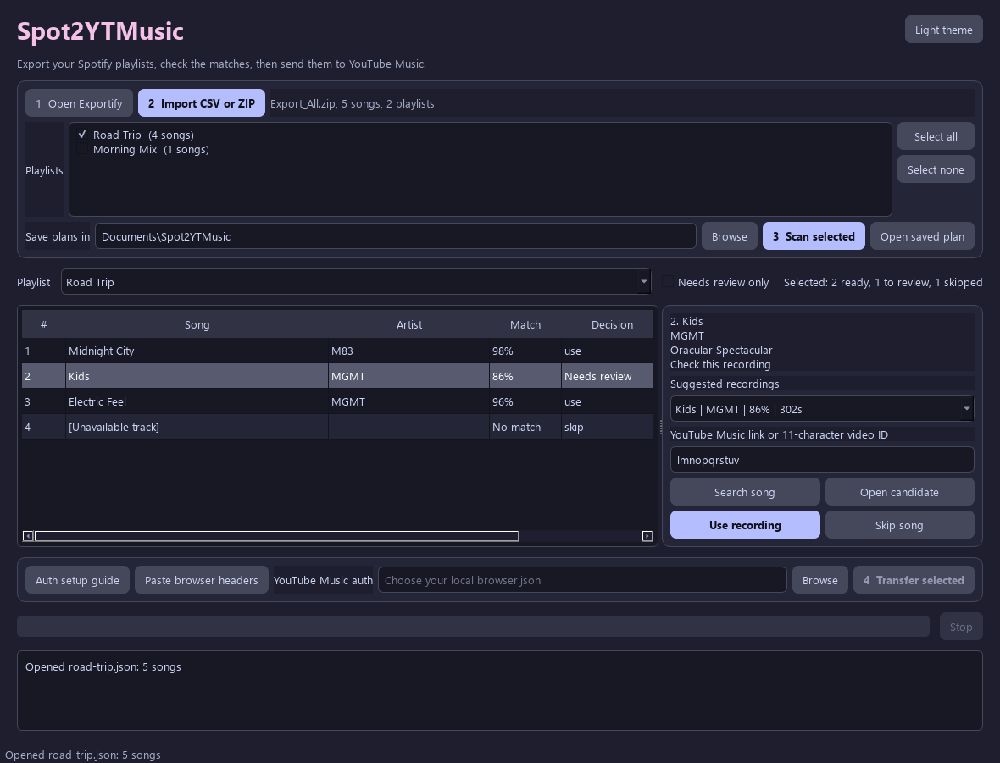

[](https://github.com/SysAdminDoc/Spot2YTMusic/releases/tag/v0.1.1) [](LICENSE) [](https://github.com/SysAdminDoc/Spot2YTMusic/releases/latest)

**Take your Spotify playlists to YouTube Music, with the right recordings in the right order.** Spot2YTMusic opens your playlist exports, searches YouTube Music, and lets you check uncertain matches before anything is added. It handles several playlists at once and can pick up a stopped transfer after checking what made it across.

[Download the Windows app](https://github.com/SysAdminDoc/Spot2YTMusic/releases/latest) or [install the Python tool](#run-from-source). The app runs locally. It needs no Spotify developer account.



## Move your playlists

1. Open [Exportify](https://exportify.app/) from the app and sign in to Spotify. Download individual playlist CSVs or use **Export All** for a ZIP.
2. Import the files. You can choose several CSVs, a ZIP, or both. Pick where to save the transfer plan, then click **Scan all**.
3. Check songs marked **Needs review**. Listen to a suggested recording or search YouTube Music yourself. Choose **Use recording** or **Skip song**. Each choice is saved as you make it.
4. Set up YouTube Music authentication using the guide in the app. Paste the browser request headers into the app to create a local auth file, or browse for one you already have. Click **Transfer all**.

Strong matches are selected for you. The app waits for your decision on uncertain songs. It creates private playlists and verifies the song order after every batch. If a transfer stops, open the saved plan and run **Transfer all** again. Your review choices and completed batches are kept.

The [Exportify project](https://github.com/watsonbox/exportify) runs in your browser. Spotify's own [Download your data](https://support.spotify.com/us/article/understanding-your-data/) produces JSON, which Spot2YTMusic does not read yet.

## What stays on your computer

The imported files, match cache, plan, review sheet, and transfer state stay local. Search queries containing song titles and artists go to YouTube Music. An auth file created in the app stays in your Windows profile. Don't share it or paste its contents into an issue.

Spot2YTMusic uses the unofficial [ytmusicapi](https://ytmusicapi.readthedocs.io/en/stable/) library for YouTube Music. A site change can interrupt a search or transfer. It won't copy audio, set likes, or keep future Spotify edits in sync. Some recordings may need a manual choice or may be unavailable.

## Run from source

Python 3.11 or newer works on Windows, macOS, and Linux. The graphical app uses Qt; the command line tool can be installed without it.

```powershell
git clone https://github.com/SysAdminDoc/Spot2YTMusic.git
cd Spot2YTMusic
python -m venv .venv
.\.venv\Scripts\python -m pip install -e ".[gui]"
.\.venv\Scripts\spot2ytmusic-gui
```

On macOS or Linux, use `python3 -m venv .venv`, `.venv/bin/python`, and `.venv/bin/spot2ytmusic-gui` instead. For the command line tool alone, install with `pip install -e .`.

### Command line

The importer accepts Exportify CSVs and Export All ZIPs. It also accepts a CSV with `Song` and `Artist` columns. `Collection`, `Position`, `Album`, and `Duration` are optional. Without a collection column, the filename becomes the playlist name.

```powershell
.\.venv\Scripts\spot2ytmusic inspect Export_All.zip
.\.venv\Scripts\spot2ytmusic scan Export_All.zip Extra_Playlist.csv --plan plans\transfer.json
```

The scan writes `plans\transfer.review.csv`. Review its candidate links. Set each undecided row to `use` with an 11-character `Chosen video ID`, or `skip` it. Keep the `Key` column. To transfer one playlist:

```powershell
.\.venv\Scripts\spot2ytmusic apply plans\transfer.json --playlist "Road Trip" --auth browser.json
```

Follow the [browser authentication guide](https://ytmusicapi.readthedocs.io/en/stable/setup/browser.html) to create `browser.json`. OAuth also works with the [ytmusicapi setup guide](https://ytmusicapi.readthedocs.io/en/stable/setup/oauth.html); set `YTMUSIC_CLIENT_ID` and `YTMUSIC_CLIENT_SECRET`. The app can create a browser auth file from headers you paste there. Don't commit an auth file to Git.

## Build and test

```powershell
.\.venv\Scripts\python -m pip install -e ".[gui,dev]"
.\.venv\Scripts\python -m pytest -q
.\.venv\Scripts\ruff check src tests scripts
.\scripts\build_windows.ps1
```

The build script makes a single-file Windows EXE, a ZIP with the license notices, a wheel, a source archive, and SHA-256 checksums in `dist`. The EXE is currently unsigned, so Windows may show a publisher warning. The Qt runtime is covered by [third-party notices](THIRD_PARTY_NOTICES.md).

Released under the [MIT License](LICENSE). If this project saved you some time, [support it here](https://ko-fi.com/X8K126YVER).
